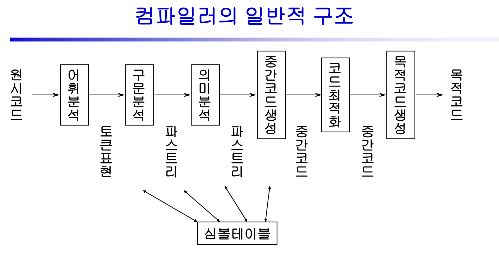

# Compiler

구현부분
-----
어휘분석 : 원시프로그램을 입력으로 어휘분석기를 통해 토큰으로 반환 (허용되지 않는 문자의 입력을 검출)

구문분석 : 어휘분석에서 나온 토큰을 입력으로 받아 구문트리(AST)를 반환. (문맥 무관 문법) (문법에 맞지 않는 문장을 검출)

중간코드생성 : 파스트리를 순회하면서 생성함

미구현부분
-----
의미분석 : 의미가 정의되지 않는 문장들을 검출 (선언되지 않는 변수 사용 / 자료형 불일치 / 매개변수의 갯수와 형의 불일치)

코드최적화

목적코드생성

파일 설명
-----
HW2. 어휘분석기 flex 연습1
  입력들을 정규표현에 따라 토큰을 발행하는 다양한 예제 연습

HW3. 어휘분석기 flex 연습2
  주석처리 연습

HW4. ToyPL문법에 맞게 작성된 파일들에 대해 어휘분석기 구현

HW5. ToyPL문법에 맞는지 구문분석기를 구현

HW6. 구문분석기를 통해 나온 파스트리를 구문트리(AST)로 변환해 출력

HW7. 기초적인 어셈블리어를 변형시킨 언어로 중간코드 출력연습 예제 구현
